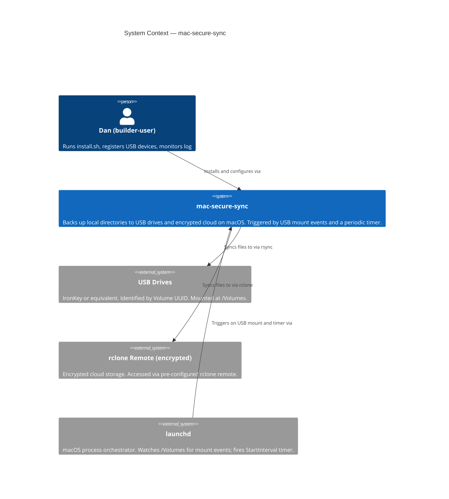
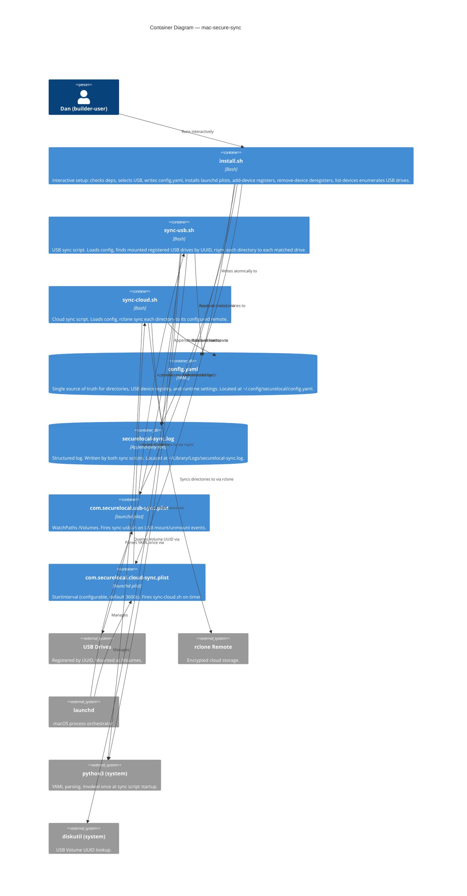
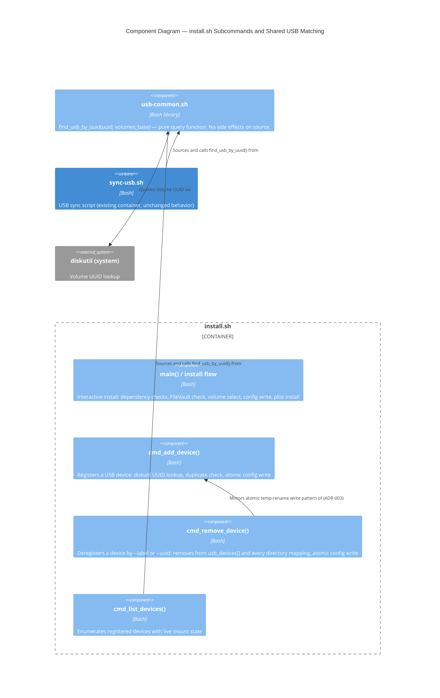

# C4 Diagrams — mac-secure-sync

**Feature:** multi-usb-sync
**Wave:** DESIGN
**Date:** 2026-05-15

---

## L1 — System Context

---

## L2 — Container

---

## L3 — Component (install.sh subcommands + shared USB matching)

**Feature:** usb-device-lifecycle (2026-08-24)

Produced for this subsystem only: `install.sh` now dispatches to 3 subcommands plus its interactive install flow, and introduces the project's first cross-container shared library (ADR-004). This crosses the "5+ components" / cross-container-reuse threshold that the L2 view cannot show without mixing abstraction levels.

See ADR-004 for the reuse decision and rejected alternatives.

## Notes

- L1/L2 container topology is unchanged by usb-device-lifecycle: same containers, extended `install.sh` behavior. `bin/lib/usb-common.sh` is a source-time library, not a deployment unit, so it appears only at L3, not as a new L2 container.
- L3 (Component) was previously not produced (both sync scripts had fewer than 5 internal functions). It is now produced for the `install.sh` subsystem only, per the 5+ components / cross-container-reuse trigger.
- Every arrow is labeled with a verb phrase per the C4 convention.
- Abstraction levels are not mixed: launchd plists are Containers (deployment units), not Components of a script.
