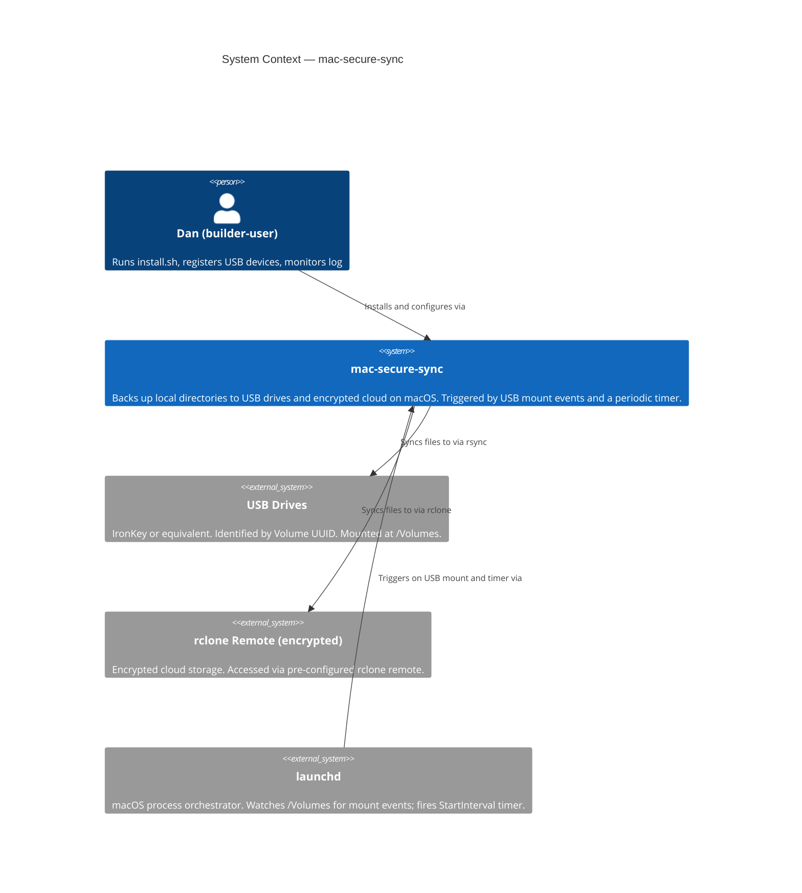
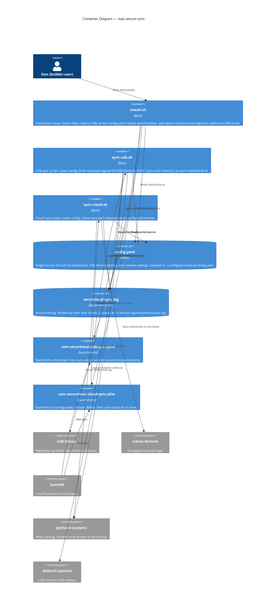

# C4 Diagrams — mac-secure-sync

**Feature:** multi-usb-sync
**Wave:** DESIGN
**Date:** 2026-05-15

---

## L1 — System Context

---

## L2 — Container

---

## Notes

- L3 (Component) is not produced. Both sync scripts have fewer than 5 internal functions each; a Component diagram would add no information beyond the Container view and the Component Map in `brief.md`.
- Every arrow is labeled with a verb phrase per the C4 convention.
- Abstraction levels are not mixed: launchd plists are Containers (deployment units), not Components of a script.
